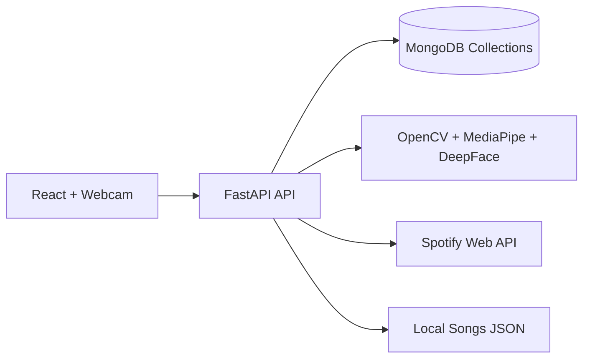

# MoodTune AI

MoodTune AI is a full-stack facial-expression music recommendation application. It captures a webcam image, detects the user's emotion with OpenCV, MediaPipe, and DeepFace, then recommends music using Spotify when credentials are configured or a curated local catalog when they are not.

## Features

- JWT authentication with register, login, logout, forgot password, reset password, profile editing, password changes, and profile picture upload.
- Emotion detection for happy, sad, angry, fear, neutral, surprise, and disgust, including confidence, processing time, timestamp, and camera state.
- Music recommendations based on emotion, favorite genres, listening history, and time of day.
- Spotify Client Credentials integration with track, artist, album, cover, popularity, preview URL, and Spotify URL data.
- Local curated music fallback when Spotify credentials are unavailable.
- User dashboard with webcam capture, recommendations, favorites, recent activity, weekly mood chart, monthly analytics, and history.
- Admin dashboard with total users, total recommendations, most detected emotion, activity charts, API statistics, and user management.
- Docker Compose setup with MongoDB, backend, and frontend services.

## Architecture



## Folder Structure

```text
backend/        FastAPI application, AI services, Spotify integration
frontend/       React Vite application
docker/         Deployment helpers
docs/           Architecture notes
screenshots/    Product screenshots
tests/          Backend contract tests
```

## Installation

1. Copy environment variables:

```bash
cp .env.example .env
```

2. Start MongoDB locally or run the full stack with Docker Compose:

```bash
docker compose up --build
```

3. Run the backend locally:

```bash
cd backend
python -m venv .venv
.venv\Scripts\activate
pip install -r requirements.txt
uvicorn app.main:app --reload
```

4. Run the frontend locally:

```bash
cd frontend
npm install
npm run dev
```

The frontend runs at `http://localhost:5173`; API docs are available at `http://localhost:8000/api/docs`.

## Environment Variables

| Variable | Description |
| --- | --- |
| `MONGO_URL` | MongoDB connection string |
| `MONGO_DB` | Mongo database name |
| `JWT_SECRET` | Secret used to sign JWT access tokens |
| `FRONTEND_ORIGIN` | Allowed browser origin for CORS |
| `SPOTIFY_CLIENT_ID` | Spotify application client ID |
| `SPOTIFY_CLIENT_SECRET` | Spotify application client secret |
| `VITE_API_URL` | Frontend API base URL |

## API Documentation

FastAPI generates Swagger documentation at `/api/docs`.

Primary resources:

- `/api/auth/*` for authentication and profile operations.
- `/api/emotions/detect` for webcam emotion analysis.
- `/api/recommendations` and `/api/recommendations/history` for recommendation workflows.
- `/api/favorites` for favorite songs.
- `/api/admin/stats` for administrative analytics.

## Screenshots

Place production screenshots in `screenshots/`. The application includes dashboard, profile, and admin experiences ready for capture after deployment.

## Deployment

Backend deployment is Render-ready using `backend/Dockerfile` and `docker/backend.render.yaml`. Configure MongoDB and Spotify secrets in Render.

Frontend deployment is Vercel-ready using `frontend/vercel.json`. Set `VITE_API_URL` to the deployed backend API URL.

For containerized deployment, use:

```bash
docker compose up --build
```

## Future Scope

- Add email delivery for password reset tokens.
- Add playlist creation for authenticated Spotify users.
- Train a domain-specific expression model for music recommendation tuning.
- Add collaborative filtering across anonymized recommendation history.

## License

MIT License.
