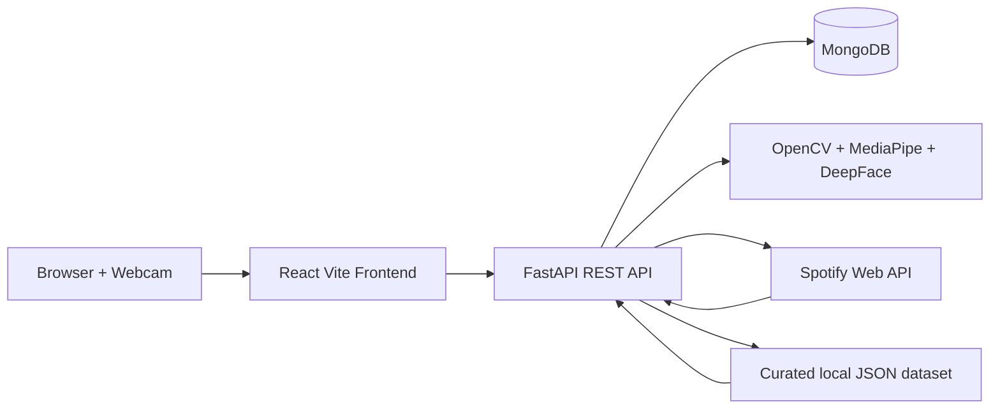

# MoodTune AI Architecture

The backend owns authentication, emotion analysis, recommendation persistence, favorites, and admin analytics. The frontend consumes documented REST endpoints and stores only the JWT access token locally.
